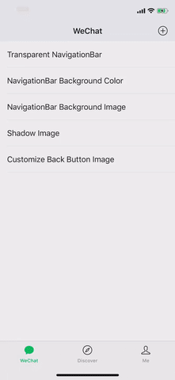

[](#)
[](https://img.shields.io/cocoapods/v/WXNavigationBar.svg)
[](https://github.com/Carthage/Carthage)
[](#)

# WXNavigationBar
WeChat NavigationBar



* [Features](#features)
* [Requirements](#requirements)
* [安装](#安装)
   * [CocoaPods](#cocoapods)
   * [Carthage](#carthage)
   * [Swift Package Manager](#swift-package-manager)
* [实现原理](#实现原理)
* [开始使用](#开始使用)
   * [基于 UINavigationController 的配置](#基于-uinavigationcontroller-的配置)
   * [基于 UIViewController 的配置](#基于-uiviewcontroller-的配置)
      * [背景颜色](#背景颜色)
      * [背景图片](#背景图片)
      * [系统样式的导航栏](#系统样式的导航栏)
      * [导航栏 barTintColor](#导航栏-bartintcolor)
      * [导航栏 tintColor](#导航栏-tintcolor)
      * [导航栏阴影图片](#导航栏阴影图片)
      * [导航栏阴影颜色](#导航栏阴影颜色)
      * [导航栏返回按钮图片](#导航栏返回按钮图片)
      * [导航栏返回按钮自定义](#导航栏返回按钮自定义)
      * [启用全屏返回手势](#启用全屏返回手势)
      * [全屏手势返回距离](#全屏手势返回距离)
* [高级用法](#高级用法)
   * [导航栏透明](#导航栏透明)
      * [设置透明度](#设置透明度)
      * [设置隐藏](#设置隐藏)
      * [设置背景颜色](#设置背景颜色)
   * [动态更新导航栏样式](#动态更新导航栏样式)
   * [wx_navigationBar](#wx_navigationbar)
* [注意点](#注意点)
   * [Child View Controller](#child_view_controller)
* [License](#license)


## Features

- [x] 支持设置导航栏背景颜色
- [x] 支持设置导航栏背景图片
- [X] 支持Large Title模式
- [x] 支持iOS 13 暗黑模式
- [x] 支持全屏手势返回
- [x] 同使用UINavigationBar一样简单


## Requirements

- iOS 12.0+
- Xcode 11.0+
- Swift 5.0+

## 安装

### CocoaPods

`WXNavigationBar` 可以通过CocoaPods安装，在`Podfile`中添加

```bash
use_frameworks!
pod 'WXNavigationBar', '~> 1.8.5'
```

### Carthage

`WXNavigationBar` 也可以通过[Carthage](https://github.com/Carthage/Carthage)进行安装，你可以添加如下代码到 Cartfile中：

```bash
github alexiscn/WXNavigationBar
```

### Swift Package Manager

```
dependencies: [
    .package(url: "https://github.com/alexiscn/WXNavigationBar.git", .upToNextMajor(from: "1.8.5"))
]
```


## 实现原理

`WXNavigationBar`通过将系统导航栏设为透明，在View中添加一个NavigationBar相同大小，相同位置的View作为假的导航栏。

原始的UINavigationBar还是用于处理手势相关逻辑，WXNavigationBar用于展示部分，比如背景颜色、背景图片等。

所以你可以像平常使用UINavigationBar一样，当你需要处理导航栏显示的时候，使用WXNavigationBar。


## 开始使用

使用WXNavigationBar不需要特殊的初始化配置，默认的就如同微信中的导航栏一样。当你需要配置时，有两种方式可以配置。使用`UINavigationController.Nav`中的属性对`UINavigationController`进行配置，或者重写`UIViewController`中的相关属性对`UIViewController`进行配置。

### 基于 UINavigationController 的配置

在`AppDelegate.swift`中全局配置，可选

```swift

import WXNavigationBar

func application(_ application: UIApplication, didFinishLaunchingWithOptions launchOptions: [UIApplication.LaunchOptionsKey: Any]?) -> Bool {

    // ...
    
    // configure WXNavigationBar
    // WXNavigationBar.NavBar.backImage = UIImage(named: "xxx")    
}

```

有如下的这些配置选项：

```swift
/// 导航栏返回按钮
public static var backImage: UIImage? = Utility.backImage

/// 自定义视图定制导航栏返回按钮
public static var backButtonCustomView: UIView? = nil
        
/// 导航栏背景图片
public static var backgroundImage: UIImage? = nil

/// 导航栏背景颜色
public static var backgroundColor: UIColor = UIColor(white: 237.0/255, alpha: 1.0)

/// 导航栏的tintColor
public static var tintColor = UIColor(white: 24.0/255, alpha: 1.0)

/// 导航栏底部阴影图片
public static var shadowImage: UIImage? = UIImage()

/// 是否启用全屏左滑手势
public static var fullscreenPopGestureEnabled = false
```

### 基于 UIViewController 的配置

你也可以通过重写 `WXNavigationBar`支持的属性对制定的ViewController进行配置。

#### 背景颜色

你可以通过如下属性设置导航栏的背景颜色

```swift
/// Background color of fake NavigationBar
/// Default color is UIColor(white: 237.0/255, alpha: 1.0)
override var wx_navigationBarBackgroundColor: UIColor? {
    return .white
}
```

#### 背景图片

你可以配置导航栏的背景图片：

```swift
override var wx_navigationBarBackgroundImage: UIImage? {
    return UIImage(named: "icons_navigation_bar")
}
```

#### 系统样式的导航栏

当你需要使用系统样式得导航栏时，可以将 `wx_useSystemBlurNavBar`设为`true`:

```swift
override var wx_useSystemBlurNavBar: Bool {
    return true
}
```

#### 导航栏 barTintColor

```swift
override var wx_barBarTintColor: UIColor? {
    return .red
}
```

#### 导航栏 tintColor

```swift
override var wx_barTintColor: UIColor? {
    return .black
}
```

#### 导航栏阴影图片

你可以设置导航栏底部黑线图片，比如是纯色的图片，或是渐变的图片。

```swift
override var wx_shadowImage: UIImage? {
    return UIImage(named: "icons_navigation_bar_shadow_line")
}
```

#### 导航栏阴影图片

为了方便起见，可以使用`wx_shadowImageTintColor`来指定导航栏底部黑线的颜色，如果使用了`wx_shadowImageTintColor`，则`wx_shadowImage`会被忽略。

```swift
override var wx_shadowImageTintColor: UIColor? {
    return .red
}
```

#### 导航栏返回按钮图片

你可以给特定的ViewController设置特定的返回按钮图片：

```swift
override var wx_backImage: UIImage? {
    return UIImage(named: "icons_view_controller_back_image")
}
```

#### 导航栏返回按钮自定义

你可以创建自定义视图来设定自定义返回按钮：

```swift
override var wx_backButtonCustomView: UIView? {
    let label = UILabel()
    label.text = "back"
    label.textAlignment = .center
    return label
}
```

#### 启用全屏返回手势

```swift
override var wx_interactivePopEnabled: Bool {
    return false
}
```

#### 全屏手势返回距离

```swift
override wx_interactivePopMaxAllowedInitialDistanceToLeftEdge: CGFloat {
    return view.bounds.width * 0.5
}
```

## 高级用法

这里列出了`WXNavigationBar`的一些高级用法：

### 导航栏透明

有多种方式可以设置导航栏透明：

##### 设置透明度

```swift
wx_navigationBar.alpha = 0
```

#### 设置隐藏

```swift
wx_navigationBar.isHidden = true
```

#### 设置背景颜色


```swift
override var wx_navigationBarBackgroundColor: UIColor? {
    return .clear
}
```

### 动态更新导航栏样式

参考 `MomentViewController`

### wx_navigationBar

`wx_navigationBar`是`UIView`的子类，所以你可以对其做任何可以对`UIView`的逻辑。比如增加渐变的`GradientLayer`，比如增加导航栏动画等等。

## 注意点

### Child View Controller

当动态添加Child View Controller时，`wx_navigationBar` 可能被遮盖，所以你你需要手动将其移到最前面

```swift
// addChild(controller) or addSubview
view.bringSubviewToFront(wx_navigationBar)
```

## License

`WXNavigationBar`基于MTI协议。[LICENSE](LICENSE)
